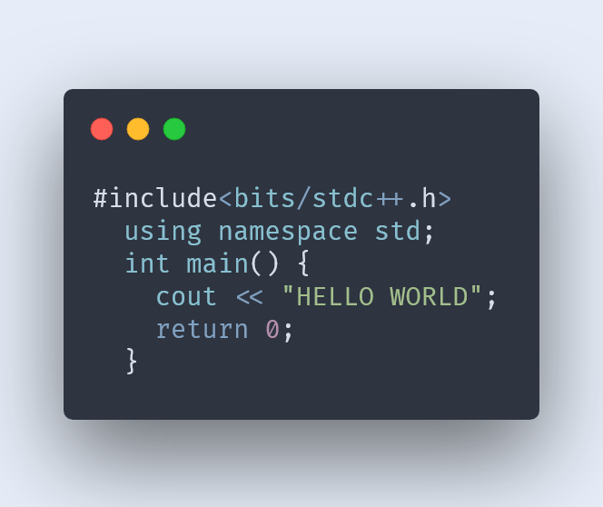

## Carbon Screenshot from Heroku App

A heroku app to take carbon screenshots (carbon.now.sh) of any code snippet.

### Usage

Request Example:

```js
const code = `#include<bits/stdc++.h>
  using namespace std;
  int main() {
    cout << "HELLO WORLD";
    return 0;
  }`;

const params = {
  backgroundColor: '#E6EDF8',
  dropShadow: true,
  dropShadowBlurRadius: '68px',
  dropShadowOffsetY: '20px',
  fontFamily: 'Fira Code',
  fontSize: '14px',
  lineHeight: '133%',
  lineNumbers: false,
  paddingHorizontal: '35px',
  paddingVertical: '49px',
  squaredImage: false,
  theme: 'nord',
  widthAdjustment: true,
  language: 'auto',
};

const takeSS = async () => {
  try {
    const resp = await axios.post(
      `https://carbon-ss.herokuapp.com/api/carbon-ss?${qs.stringify(params)}`,
      {
        data: code,
      }
    );
    const buff = Buffer.from(resp.data.image, 'base64');
  } catch (err) {
    console.log(err);
  }
};
// to take screenshot of provided code
takeSS();
```

Output:


